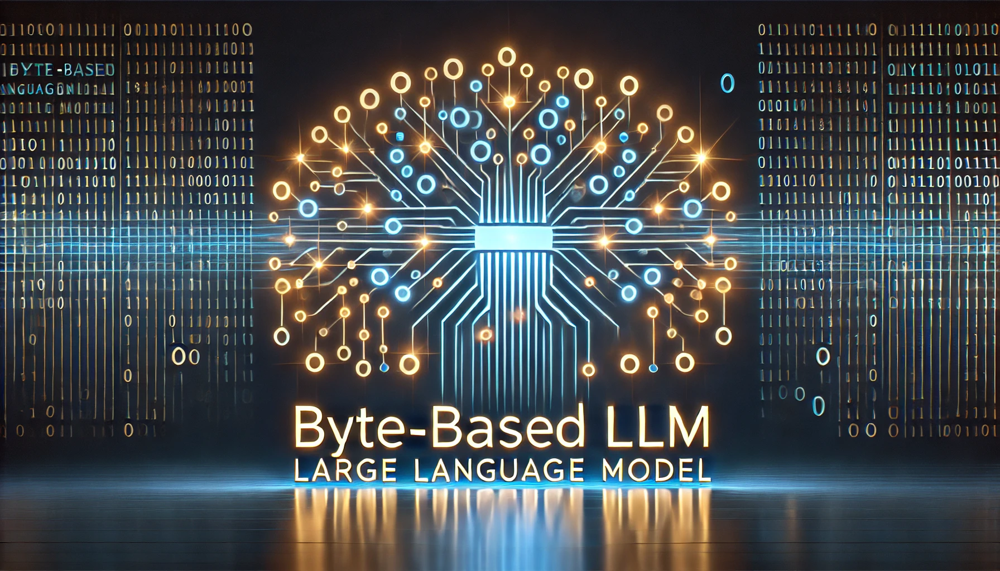

  

# Awesome Byte-Based Large Language Models

## Introduction

Recently, there has been a growing interest in studying byte-based large language models (LLMs). These models eliminate the need for tokenization and operate directly on raw bytes—the universal format of the digital world. Byte-based models offer several promising advantages, including but not limited to:

- **Enhanced robustness and generalization:** By removing the heuristic biases introduced by tokenization, these models could achieve better adaptability.
- **Cross-modality scalability:** Since all data can be represented as bytes, these models naturally extend to multiple modalities.

This repository serves as an ongoing collection of papers and resources focused on byte-based LLMs.

## Papers

The meaning of most fields are clear by their names. "Date" is the time that the work is released/made public (e.g., the timestamp of its first arXiv version). "Summary" is a one-sentence summary of the paper.

| Title | Date (MM/YY) | Source | Code | Summary |
|-------|:------------:|:------:|:----:|---------|
| [Byte Latent Transformer: Patches Scale Better Than Tokens](https://ai.meta.com/research/publications/byte-latent-transformer-patches-scale-better-than-tokens/) | 12/24 | Meta | [official](https://github.com/facebookresearch/blt) | 
The paper introduces the Byte Latent Transformer (BLT), a novel byte-level large language model (LLM) that dynamically groups bytes into patches, improving inference efficiency, robustness, and scalability beyond tokenization-based models.
 |
| [Beyond Language Models: Byte Models are Digital World Simulators](https://arxiv.org/abs/2402.19155) | 02/24 | arXiv | [official](https://github.com/sanderwood/bgpt) | 
The paper introduces bGPT, a next-byte prediction model that operates directly on binary data to simulate diverse digital world processes, achieving state-of-the-art performance in modalities like text, audio, images, symbolic music conversion, and even CPU behavior simulation with over 99.99% accuracy.
 |
| [MambaByte: Token-free Selective State Space Model](https://arxiv.org/pdf/2401.13660) | 01/24 | COLM'24 | [official](https://github.com/jxiw/MambaByte) | 
MambaByte introduces a token-free selective state space model (SSM) that enables efficient language modeling of byte-level sequences with a fixed-sized memory state, outperforming subword and byte-level Transformers on language modeling tasks while offering improved robustness, efficiency, and speculative decoding for faster inference.
 |
| [Bytes Are All You Need: Transformers Operating Directly On File Bytes](https://arxiv.org/pdf/2306.00238) | 06/23 | TMLR | [official](https://github.com/apple/corenet/tree/main/projects/byteformer) | 
The paper introduces ByteFormer, a modality-independent transformer architecture that operates directly on file bytes, eliminating the need for modality-specific processing, and demonstrates superior performance on classification tasks across images, audio, and mixed-modality data.
 |
| [MEGABYTE: Predicting Million-byte Sequences with Multiscale Transformers](https://arxiv.org/pdf/2305.07185) | 05/23 | NeurIPS'23 | [unofficial](https://github.com/lucidrains/MEGABYTE-pytorch) | 
The paper introduces MEGABYTE, a multiscale Transformer architecture that segments sequences into patches, enabling efficient modeling of million-byte sequences with sub-quadratic self-attention, enhanced feedforward computation, and improved decoding parallelism, achieving competitive performance on tasks like long-context language modeling, image generation, and audio modeling.
 |

## Contributing

Contributions are always welcome. There are two ways to add a new paper:
1. The easiest way is to open an issue, where I have a template for you to fill out.
2. If you would like to be listed as a contributor, you can add the paper to `papers.json` and make a pull request. Please do NOT directly edit `README.md`.
